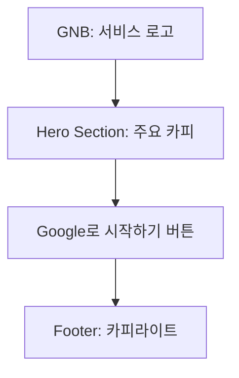
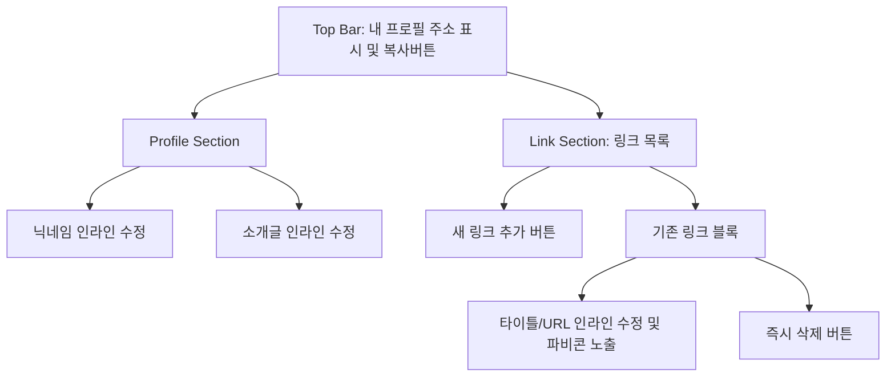

# 마이링크 (My Link) - 와이어프레임 (Wireframes)

이 문서는 "마이링크(My Link)" 서비스의 주요 화면 설계를 마크다운, Mermaid 다이어그램, 그리고 ASCII 아트를 활용하여 정의합니다. PRD 및 사용자 시나리오를 바탕으로 작성되었습니다.

---

## 1. 랜딩 페이지 (Landing Page)

사용자가 서비스에 처음 진입했을 때 보는 화면입니다. 복잡한 설명 없이 서비스의 핵심 가치 전달과 구글 로그인 유도에 집중합니다.

### 1.1 구조도 (Mermaid)


### 1.2 화면 설계 (ASCII Art)
```text
+---------------------------------------------------+
|  [로고] My Link                                   |
+---------------------------------------------------+
|                                                   |
|                                                   |
|           나만의 모든 링크, 단 하나의 주소로      |
|                                                   |
|           [ G Google로 시작하기 ]                 |
|                                                   |
|                                                   |
|                                                   |
|                                                   |
|                                                   |
+---------------------------------------------------+
|  © 2024 My Link. All rights reserved.             |
+---------------------------------------------------+
```

---

## 2. 대시보드 (Dashboard)

로그인 후 자신의 링크와 프로필을 관리하는 공간입니다. 별도의 설정 페이지 이동 없이 **모든 수정이 인라인(Inline)으로 이루어지는 것**이 핵심입니다.

### 2.1 구조도 (Mermaid)


### 2.2 화면 설계 (ASCII Art)
```text
+---------------------------------------------------+
|  [로고] My Link                        [로그아웃] |
+---------------------------------------------------+
|                                                   |
|  [알림] 복사 완료! (Toast UI)                     |
|                                                   |
|  내 프로필 주소                                   |
|  mylink.com/dev123                      [복사]    |
|                                                   |
|  -----------------------------------------------  |
|                                                   |
|  [ dev123 (인라인 편집)                        ]  |
|  [ 안녕하세요, 프론트엔드 개발자입니다. (인라인) ]  |
|                                                   |
|  [ + 새 링크 추가 ]                               |
|                                                   |
|  +---------------------------------------------+  |
|  | [파비콘] [ 내 블로그 (인라인)             ] |  |
|  |          [ https://blog... (인라인)       ] |  |
|  |                                  [휴지통]   |  |
|  +---------------------------------------------+  |
|  | [파비콘] [ 포트폴리오 (인라인)            ] |  |
|  |          [ https://port... (인라인)       ] |  |
|  |                                  [휴지통]   |  |
|  +---------------------------------------------+  |
|                                                   |
+---------------------------------------------------+
```
*참고: URL 입력란에 잘못된 형식을 입력하고 포커스를 벗어나면 테두리가 붉은색으로 점멸(Validation UX).*

---

## 3. 프로필 뷰어 (Public Viewer)

외부 방문자가 소유자의 커스텀 URL(`mylink.com/닉네임`)로 접속했을 때 보여지는 최종 화면입니다. 오로지 콘텐츠 전달에 집중합니다.

### 3.1 구조도 (Mermaid)
```mermaid
graph TD
    A[프로필 상단 영역] --> B[프로필 닉네임]
    B --> C[프로필 소개글 (Bio)]
    A --> D[링크 목록 영역]
    D --> E[개별 링크 버튼 1]
    D --> F[개별 링크 버튼 2]
    E -.-> |클릭 시 외부 이동| G[외부 웹사이트]
    F -.-> |클릭 시 외부 이동| G
    D --> H[하단 워터마크]
```

### 3.2 화면 설계 (ASCII Art)
```text
+---------------------------------------------------+
|                                                   |
|                                                   |
|                      dev123                       |
|           안녕하세요, 프론트엔드 개발자입니다.    |
|                                                   |
|                                                   |
|        +-----------------------------------+      |
|        |  [파비콘]  내 블로그              |      |
|        +-----------------------------------+      |
|                                                   |
|        +-----------------------------------+      |
|        |  [파비콘]  포트폴리오             |      |
|        +-----------------------------------+      |
|                                                   |
|        +-----------------------------------+      |
|        |  [파비콘]  GitHub                 |      |
|        +-----------------------------------+      |
|                                                   |
|                                                   |
|                  Made with My Link                |
|                                                   |
+---------------------------------------------------+
```

---

## 4. 핵심 컴포넌트 동작 및 인터랙션 (Interaction & States)

- **인라인 편집 (Inline Editing):** 텍스트(닉네임, 소개글, 링크 타이틀, URL)를 클릭하면 즉시 `input` 또는 `textarea` 입력 필드로 전환됩니다. 엔터 키를 누르거나 마우스로 외부 영역을 클릭(Blur 이벤트) 시 편집이 종료되고 즉시 Firestore에 업데이트 됩니다.
- **파비콘 자동 매칭 (Favicon UI):** 사용자가 링크 관리에 URL 입력을 완료하면, 즉시 구글 파비콘 API를 백그라운드에서 호출하여 `[파비콘]` 이미지 위치에 노출합니다. 별도의 이미지 업로드 과정이 없습니다.
- **원클릭 삭제 경험 (One-click Delete):** '휴지통' 아이콘 클릭 시 실수 방지를 위한 재확인 모달(Alert) 없이 즉각적으로 해당 링크가 삭제 처리되어 링크 관리의 피로도를 낮춥니다.
- **유효성 검사 피드백 (Validation UX):** 필수 값인 URL이 누락되거나 올바른 형식(HTTP/HTTPS)이 아닐 경우, 해당 입력 필드의 테두리에 강조(예: `border-red-500`) 표시를 주어 사용자의 수정을 유도합니다.
